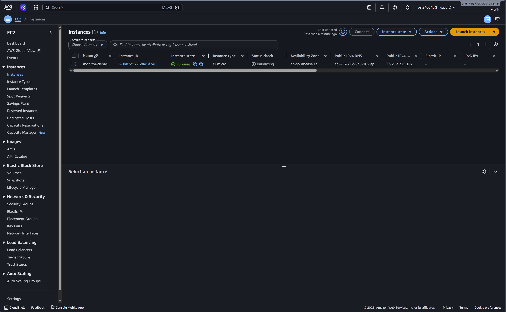
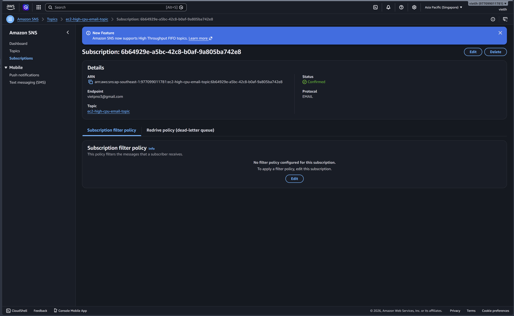
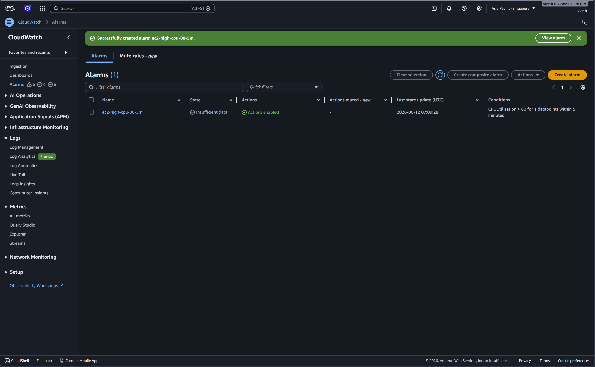
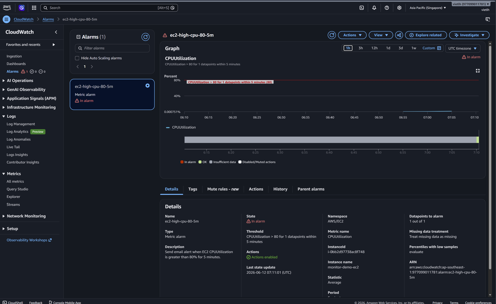
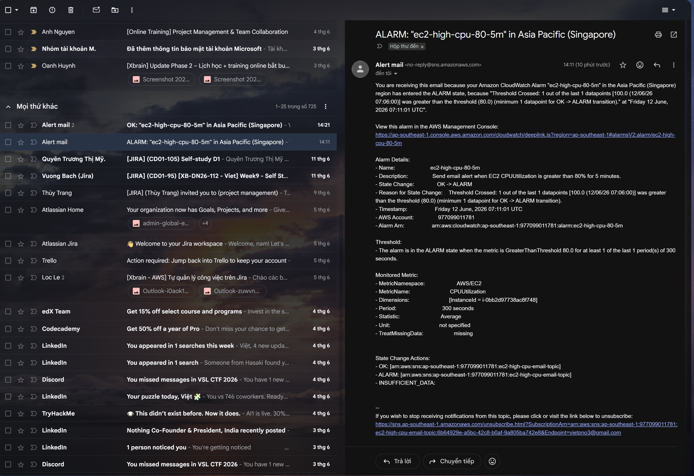

# CPU Alarm → Email Alert via Amazon SNS

## 1. Mục tiêu bài lab

Bài lab này thực hiện cấu hình cảnh báo CPU cho một EC2 instance bằng Amazon CloudWatch Alarm. Khi mức sử dụng CPU của EC2 vượt quá ngưỡng cấu hình, CloudWatch sẽ chuyển trạng thái alarm sang `In alarm` và gửi thông báo email thông qua Amazon SNS.

Mục tiêu chính:

* Tạo EC2 instance để có tài nguyên cần giám sát.
* Tạo SNS Topic dùng để gửi cảnh báo qua email.
* Tạo CloudWatch Alarm theo metric `CPUUtilization`.
* Cấu hình điều kiện cảnh báo khi CPU vượt ngưỡng.
* Kiểm tra trạng thái alarm và email cảnh báo nhận được.

---

## 2. Kiến trúc tổng quan

```text
EC2 Instance
    |
    | CPUUtilization metric
    v
Amazon CloudWatch
    |
    | CloudWatch Alarm
    v
Amazon SNS Topic
    |
    | Email Subscription
    v
User Email
```

Giải thích luồng hoạt động:

1. EC2 tự động gửi metric `CPUUtilization` về CloudWatch.
2. CloudWatch Alarm theo dõi metric CPU của EC2.
3. Nếu CPU vượt ngưỡng đã cấu hình, alarm chuyển sang trạng thái `In alarm`.
4. CloudWatch gọi SNS Topic được gắn trong alarm action.
5. SNS gửi email cảnh báo đến địa chỉ email đã subscribe và confirm.

---

## 3. Các dịch vụ AWS sử dụng

| Dịch vụ                   | Vai trò                             |
| ------------------------- | ----------------------------------- |
| Amazon EC2                | Máy chủ được giám sát CPU           |
| Amazon CloudWatch Metrics | Lưu metric `CPUUtilization` của EC2 |
| Amazon CloudWatch Alarm   | Kiểm tra điều kiện CPU vượt ngưỡng  |
| Amazon SNS                | Gửi cảnh báo đến email              |
| Email Subscription        | Nhận thông báo từ SNS               |

---

## 4. EC2 Instance được giám sát

EC2 instance được tạo để làm tài nguyên chính trong bài lab. CloudWatch mặc định có thể thu thập metric CPU của EC2 mà không cần cài thêm CloudWatch Agent.

Ảnh EC2 instance:



EC2 cần ở trạng thái `Running` để CloudWatch có dữ liệu metric. Metric được sử dụng trong bài lab là:

```text
Namespace: AWS/EC2
Metric name: CPUUtilization
Dimension: InstanceId
Statistic: Average
```

---

## 5. SNS Topic và Email Subscription

Amazon SNS được dùng làm kênh gửi thông báo. Trong bài lab này, SNS Topic nhận signal từ CloudWatch Alarm và gửi email đến người dùng.

Ảnh SNS Topic và subscription:



Điểm quan trọng:

* SNS Topic phải được tạo cùng region với CloudWatch Alarm.
* Email subscription phải được confirm.
* Nếu subscription vẫn ở trạng thái `Pending confirmation`, email cảnh báo sẽ không được gửi.

Luồng SNS:

```text
CloudWatch Alarm
    |
    v
SNS Topic
    |
    v
Confirmed Email Subscription
```

---

## 6. CloudWatch Alarm Configuration

CloudWatch Alarm được tạo để theo dõi metric `CPUUtilization` của EC2.

Ảnh cấu hình alarm:



Cấu hình alarm sử dụng trong bài lab:

| Thành phần          | Giá trị         |
| ------------------- | --------------- |
| Metric              | CPUUtilization  |
| Namespace           | AWS/EC2         |
| Statistic           | Average         |
| Period              | 5 minutes       |
| Threshold           | Greater than 80 |
| Datapoints to alarm | 1 out of 1      |
| Alarm action        | SNS Topic       |
| Notification state  | In alarm        |

Ý nghĩa cấu hình:

```text
Nếu CPU trung bình của EC2 lớn hơn 80% trong 1 chu kỳ 5 phút,
CloudWatch Alarm sẽ chuyển sang trạng thái In alarm và gửi email qua SNS.
```

---

## 7. Kiểm tra trạng thái In Alarm

Sau khi tạo tải CPU hoặc test alarm, CloudWatch Alarm chuyển sang trạng thái `In alarm`.

Ảnh alarm chuyển sang trạng thái cảnh báo:



Trạng thái `In alarm` cho biết điều kiện cảnh báo đã thỏa mãn. Khi đó CloudWatch sẽ thực hiện action đã cấu hình, trong bài này là gửi notification đến SNS Topic.

Các trạng thái chính của CloudWatch Alarm:

| Trạng thái        | Ý nghĩa                              |
| ----------------- | ------------------------------------ |
| OK                | Metric đang nằm trong ngưỡng an toàn |
| In alarm          | Metric đã vượt ngưỡng cấu hình       |
| Insufficient data | Chưa đủ dữ liệu để đánh giá          |

---

## 8. Email cảnh báo nhận được

Sau khi alarm chuyển sang trạng thái `In alarm`, SNS gửi email cảnh báo đến địa chỉ đã subscribe.

Ảnh email cảnh báo:



Email cảnh báo thường chứa các thông tin quan trọng như:

* Alarm name.
* Current state.
* Reason for state change.
* Metric name.
* Threshold.
* AWS region.
* InstanceId liên quan.

---
