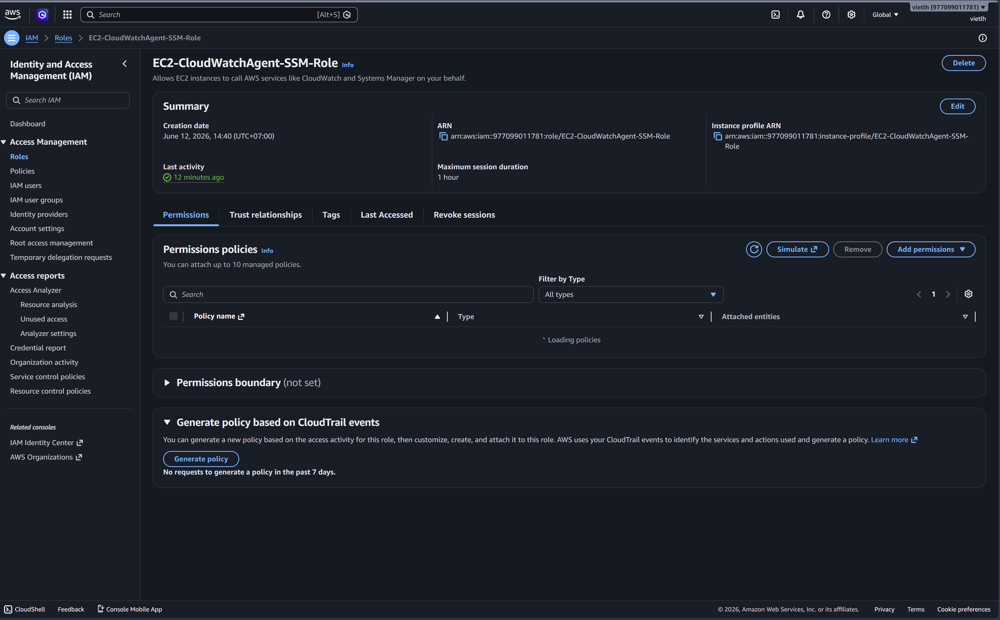
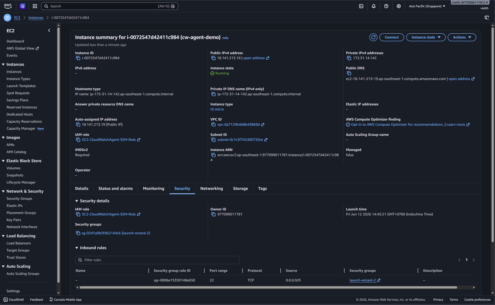
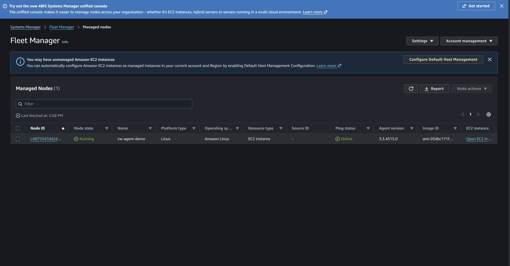
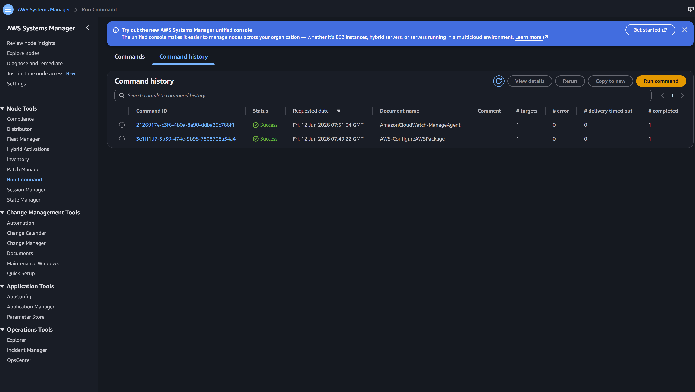
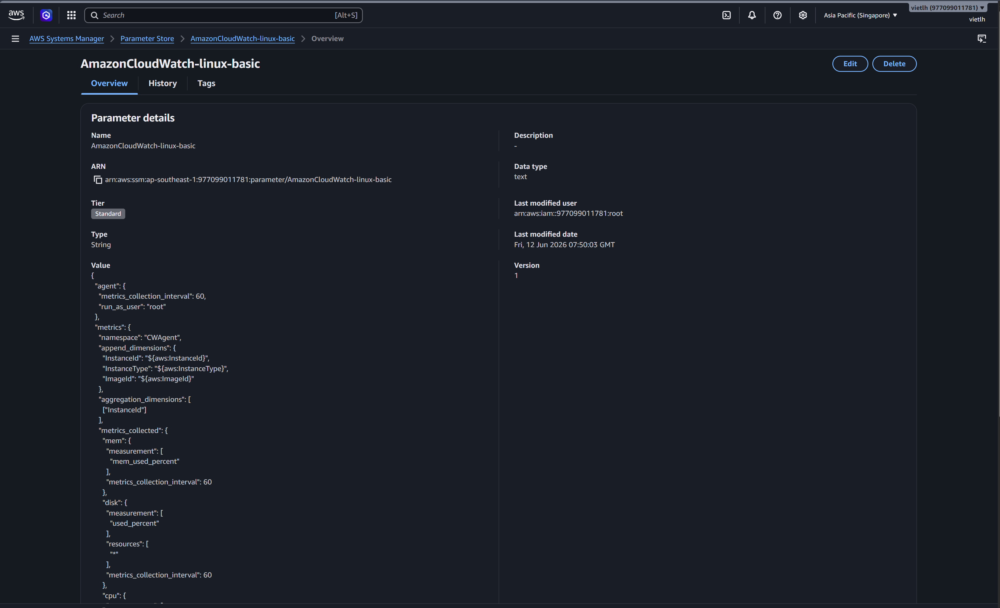
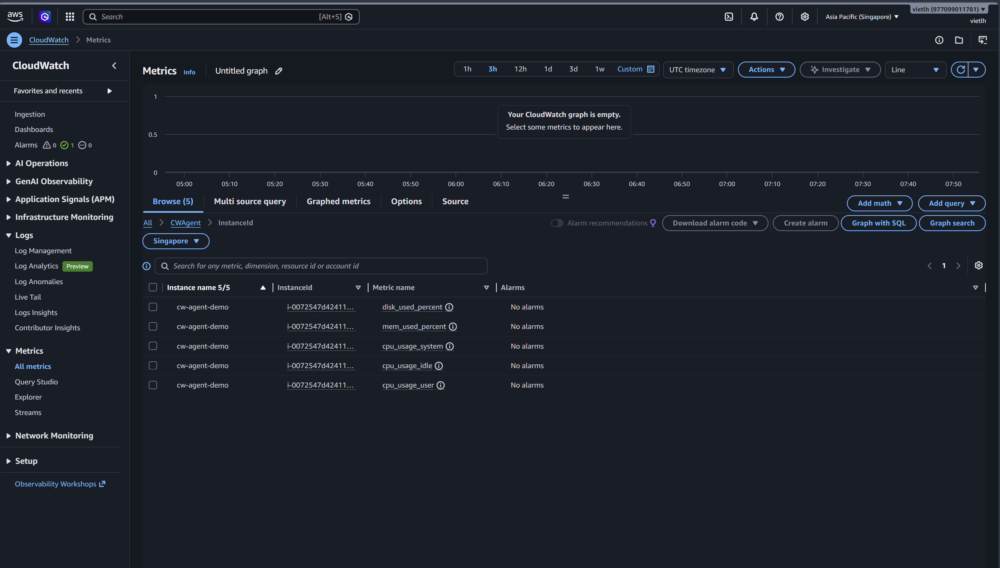
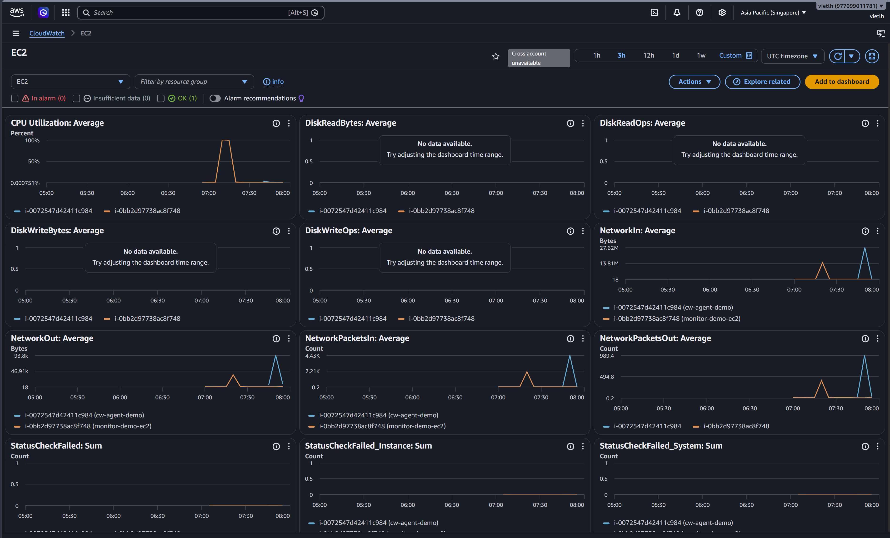

# Installing CloudWatch Agent on EC2

## 1. Mục tiêu bài lab

Bài lab này thực hiện cài đặt Amazon CloudWatch Agent trên EC2 để thu thập thêm các metric ở mức hệ điều hành như memory, disk và CPU chi tiết. Mặc định EC2 đã có metric CPU cơ bản trong CloudWatch, nhưng chưa có sẵn metric RAM và disk usage. Vì vậy cần cài CloudWatch Agent để bổ sung các metric này.

Mục tiêu chính:

* Tạo IAM Role cho EC2 có quyền dùng Systems Manager và CloudWatch Agent.
* Tạo EC2 instance và gắn IAM Role phù hợp.
* Kiểm tra EC2 xuất hiện trong Systems Manager Managed Nodes.
* Cài đặt CloudWatch Agent bằng Systems Manager Run Command.
* Tạo CloudWatch Agent configuration bằng Parameter Store.
* Kiểm tra metric `CWAgent` trong CloudWatch.
* Tạo CloudWatch Dashboard để quan sát CPU, memory và disk.

---

## 2. Kiến trúc tổng quan

```text
EC2 Instance
    |
    | CloudWatch Agent
    v
CloudWatch Metrics
    |
    | Namespace: CWAgent
    v
CloudWatch Dashboard
```

Luồng hoạt động:

1. EC2 được gắn IAM Role có quyền sử dụng Systems Manager và gửi metric lên CloudWatch.
2. Systems Manager Run Command được dùng để cài CloudWatch Agent mà không cần SSH vào máy.
3. CloudWatch Agent đọc thông tin hệ điều hành như RAM, disk và CPU chi tiết.
4. Agent gửi metric về CloudWatch trong namespace `CWAgent`.
5. CloudWatch Dashboard hiển thị các metric để theo dõi trực quan.

---

## 3. Các dịch vụ AWS sử dụng

| Dịch vụ                   | Vai trò                                  |
| ------------------------- | ---------------------------------------- |
| Amazon EC2                | Máy chủ được cài CloudWatch Agent        |
| IAM Role                  | Cấp quyền cho EC2 dùng SSM và gửi metric |
| AWS Systems Manager       | Quản lý EC2 và chạy lệnh cài agent       |
| Run Command               | Cài đặt và cấu hình CloudWatch Agent     |
| Parameter Store           | Lưu file cấu hình CloudWatch Agent       |
| Amazon CloudWatch Metrics | Lưu metric từ EC2 và CloudWatch Agent    |
| CloudWatch Dashboard      | Hiển thị biểu đồ CPU, RAM, disk          |

---

## 4. IAM Role cho EC2

EC2 cần được gắn IAM Role để có thể làm việc với Systems Manager và CloudWatch Agent.

Ảnh IAM Role:



Role sử dụng trong bài lab cần có 2 policy:

| Policy                       | Mục đích                                                |
| ---------------------------- | ------------------------------------------------------- |
| AmazonSSMManagedInstanceCore | Cho phép EC2 được quản lý bởi Systems Manager           |
| CloudWatchAgentServerPolicy  | Cho phép CloudWatch Agent gửi metric/log lên CloudWatch |

Nếu thiếu `AmazonSSMManagedInstanceCore`, EC2 có thể không xuất hiện trong Systems Manager Managed Nodes. Nếu thiếu `CloudWatchAgentServerPolicy`, agent có thể chạy nhưng không gửi được metric lên CloudWatch.

---

## 5. EC2 Instance

EC2 instance được tạo để cài CloudWatch Agent. Instance cần ở trạng thái `Running` và phải được gắn IAM Role đã tạo ở bước trước.

Ảnh EC2 instance:



Thông tin cần kiểm tra:

```text
Instance state: Running
IAM Role: EC2-CloudWatchAgent-SSM-Role
Region: Asia Pacific (Singapore)
```

Trong bài lab này không cần mở SSH inbound nếu sử dụng Systems Manager để quản lý instance.

---

## 6. Systems Manager Managed Node

Sau khi EC2 chạy và có IAM Role phù hợp, instance sẽ xuất hiện trong Systems Manager Fleet Manager hoặc Managed Nodes.

Ảnh EC2 trong Systems Manager:



Việc EC2 xuất hiện trong Managed Nodes chứng minh rằng:

* EC2 đã có SSM Agent hoạt động.
* EC2 có quyền `AmazonSSMManagedInstanceCore`.
* EC2 có kết nối outbound đến Systems Manager.
* Có thể dùng Run Command để cài CloudWatch Agent mà không cần SSH.

---

## 7. Cài đặt CloudWatch Agent bằng Run Command

CloudWatch Agent được cài bằng Systems Manager Run Command với document:

```text
AWS-ConfigureAWSPackage
```

Ảnh cài CloudWatch Agent thành công:



Cấu hình sử dụng:

```text
Action: Install
Name: AmazonCloudWatchAgent
Version: latest
```

Khi command có trạng thái `Success`, nghĩa là package CloudWatch Agent đã được cài thành công vào EC2.

---

## 8. CloudWatch Agent Configuration trong Parameter Store

CloudWatch Agent cần file cấu hình để biết cần thu thập metric nào. Trong bài lab này, cấu hình được lưu trong Systems Manager Parameter Store.

Ảnh Parameter Store config:



Parameter được sử dụng:

```text
Name: AmazonCloudWatch-linux-basic
Type: String
```

Các metric chính trong cấu hình:

| Metric            | Ý nghĩa                              |
| ----------------- | ------------------------------------ |
| mem_used_percent  | Phần trăm RAM đã sử dụng             |
| disk_used_percent | Phần trăm dung lượng disk đã sử dụng |
| cpu_usage_user    | CPU dùng bởi user process            |
| cpu_usage_system  | CPU dùng bởi system/kernel           |
| cpu_usage_idle    | CPU đang idle                        |

Cấu hình này giúp CloudWatch Agent thu thập metric ở mức hệ điều hành, điều mà EC2 basic metrics mặc định không cung cấp đầy đủ.

---

## 9. CloudWatch Agent Metrics

Sau khi agent được cấu hình và chạy thành công, CloudWatch sẽ xuất hiện namespace mới là:

```text
CWAgent
```

Ảnh metric CWAgent:



Sự khác nhau giữa metric mặc định của EC2 và metric từ CloudWatch Agent:

| Nguồn metric           | Namespace | Ví dụ metric                        |
| ---------------------- | --------- | ----------------------------------- |
| EC2 default monitoring | AWS/EC2   | CPUUtilization                      |
| CloudWatch Agent       | CWAgent   | mem_used_percent, disk_used_percent |

Điểm quan trọng là EC2 mặc định có CPU metric, nhưng muốn xem RAM và disk usage thì cần CloudWatch Agent.

---

## 10. CloudWatch Dashboard

CloudWatch Dashboard được tạo để hiển thị các biểu đồ giám sát EC2.

Ảnh dashboard:



Dashboard trong bài lab bao gồm:

* EC2 CPU Utilization.
* Memory used percent.
* Disk used percent.
* CPU usage chi tiết từ CloudWatch Agent.

Dashboard giúp người vận hành quan sát nhanh tình trạng tài nguyên của EC2 mà không cần vào trực tiếp máy chủ.

---

## 11. So sánh CloudWatch Agent và CloudWatch Alarm

| Thành phần           | Chức năng                            |
| -------------------- | ------------------------------------ |
| CloudWatch Agent     | Thu thập metric/log từ bên trong EC2 |
| CloudWatch Metrics   | Lưu trữ dữ liệu metric               |
| CloudWatch Dashboard | Hiển thị metric dạng biểu đồ         |
| CloudWatch Alarm     | Cảnh báo khi metric vượt ngưỡng      |

CloudWatch Agent không phải là hệ thống cảnh báo. Agent chỉ thu thập và gửi dữ liệu. Muốn cảnh báo khi RAM, disk hoặc CPU vượt ngưỡng thì cần tạo thêm CloudWatch Alarm dựa trên metric tương ứng.

---
